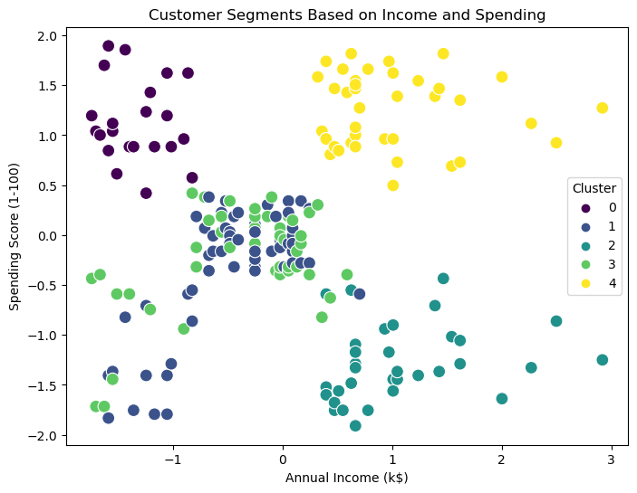

# 🛍️ Mall Customer Segmentation using K-Means Clustering

This project applies **K-Means Clustering** to perform customer segmentation based on **Annual Income** and **Spending Score** using the Mall Customers dataset.

## 📊 Objective

Segment customers into groups to improve marketing strategy by understanding customer behavior.

## 📁 Dataset

- **Source**: Mall_Customers.csv
- **Attributes**:
  - CustomerID
  - Gender
  - Age
  - Annual Income (k$)
  - Spending Score (1-100)

## 🔍 Steps Performed

1. Loaded and cleaned the dataset
2. Used **Elbow Method** to find the optimal number of clusters
3. Applied **K-Means Clustering**
4. Visualized the customer segments

## 📌 Results

### 📉 Elbow Method


### 📊 Cluster Segmentation


- Cluster 0: Careful
- Cluster 1: Standard
- Cluster 2: Target Customers
- Cluster 3: Spenders
- Cluster 4: High Income but Low Spending

## 📦 Libraries Used

- Python
- Pandas
- Matplotlib
- Seaborn
- Scikit-learn

## ▶️ Run the Code

```bash
pip install -r requirements.txt
